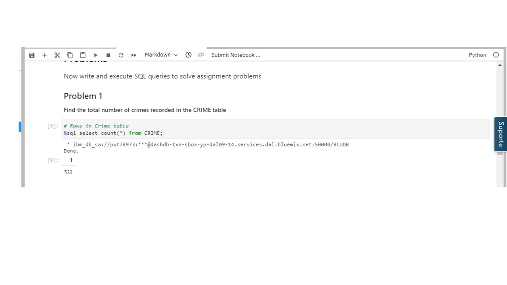
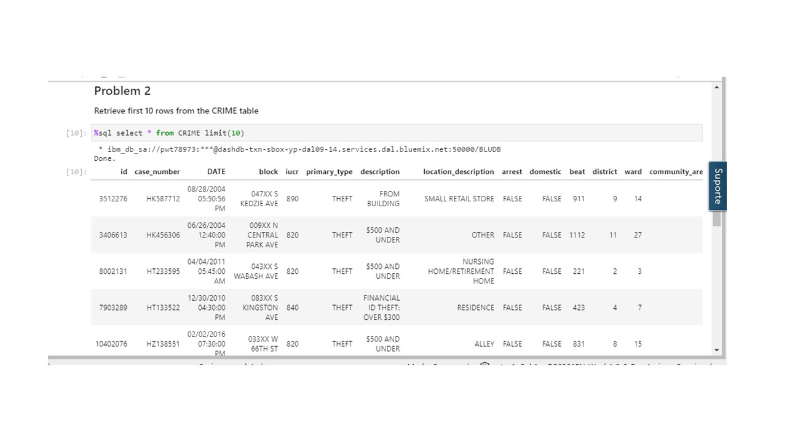
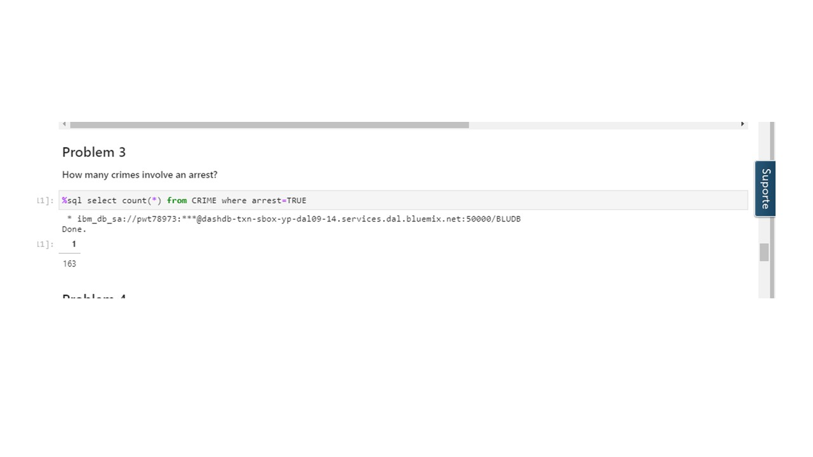
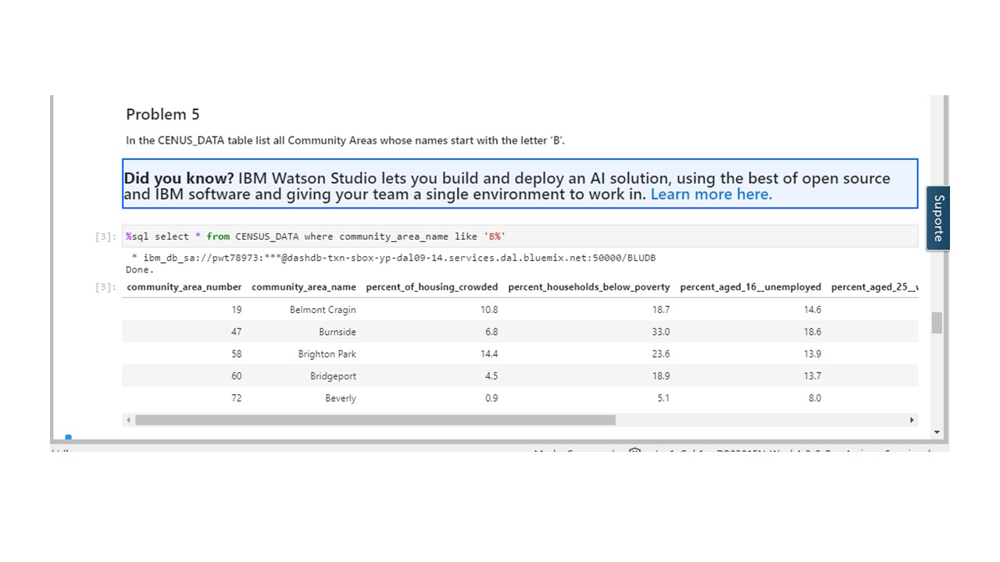
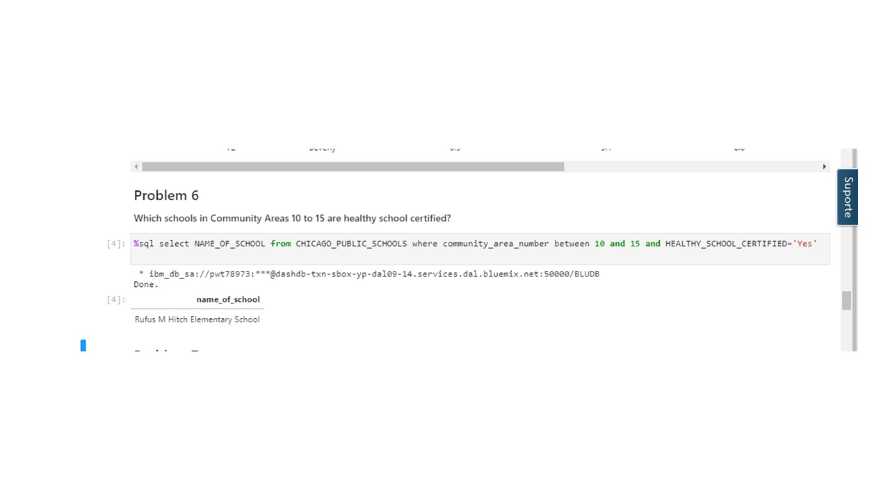
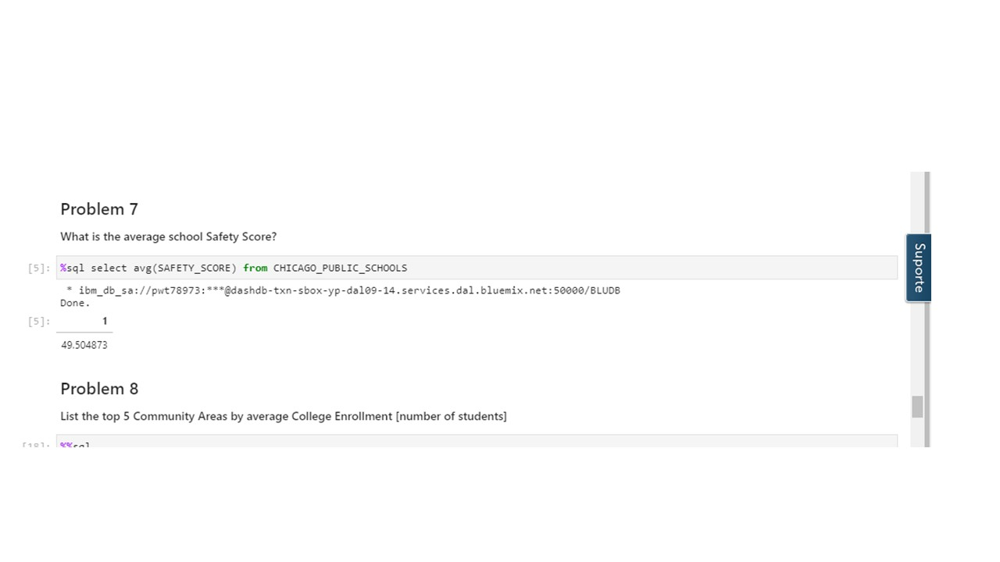
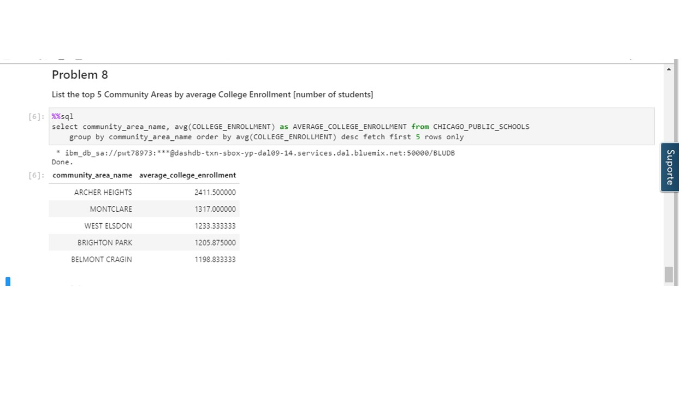
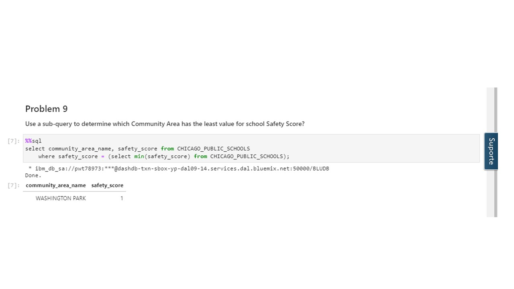
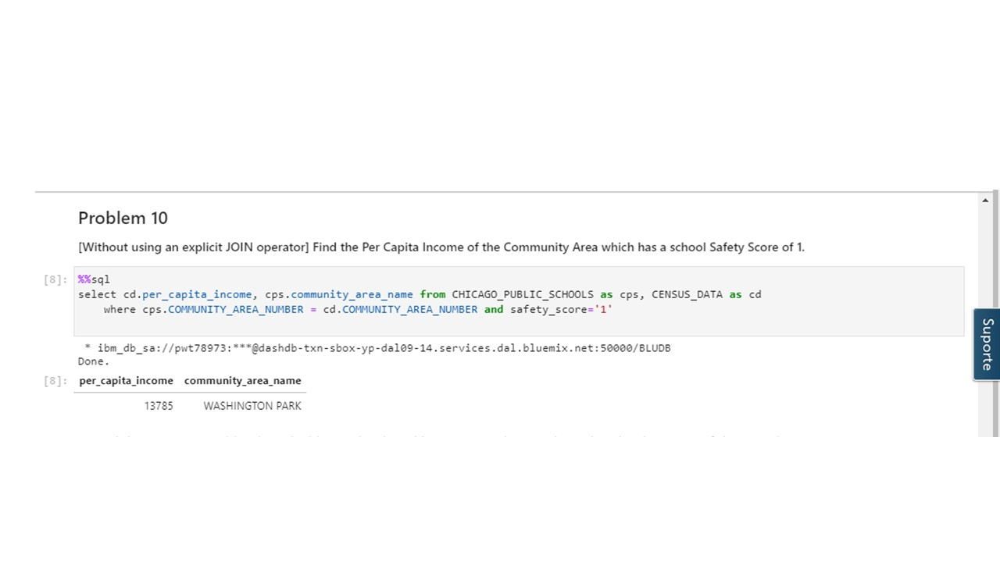

# IBM-Banco-de-dados-

Situação:

 Uma equipe de jornalismo entrou em contato com a prefeitura da cidade de Chicago para requisitar informações sobre os setores de segurança publica,  de ensino  e dos indicaadores socioeconomicos usados por eles. Coube ao responsável pelo setor de dados encaminhar essas informações para a prefeitura. O projeto usará um conjunto de dados do mundo real fornecido pelo Chicago Data Portal e deverá conter informações recuperadas do banco de dados das áreas de Segurança, Ensino e indicaadores socioeconomicos.

<h2>Screenshots</h2>

## Autor

Desenvolvido por [**Hérick S. Müller**](https://www.linkedin.com/in/herick-muller/)
